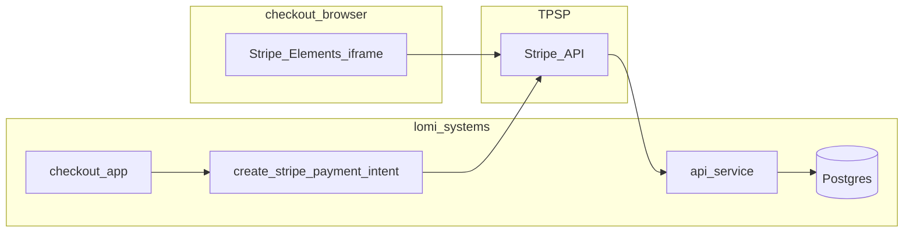
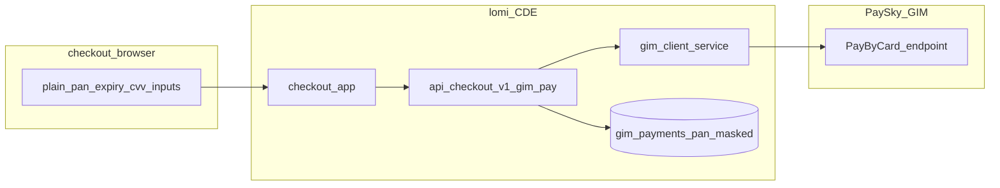

# Cardholder data environment (CDE) and data flows

Evidence-based scope as of 2026-07-14. Confirm live/production flags with ops before each assessment.

## Live today (Stripe — reduced PAN scope)

- PAN/CVV enter **Stripe-hosted** fields only (`apps/checkout/.../stripe-payment-handler.tsx`).
- lomi. stores PaymentIntent IDs, `last4`, Stripe payment method references — not full PAN/CVV.
- Direct `POST /charge/card` is **muted** (`LOMI_DIRECT_CARD_CHARGES_ENABLED` unset → 503).

## Pre-live (GIM — full PAN/CVV scope when enabled)

- Code paths: `checkout-gim.controller.ts`, `gim-checkout.service.ts`, `gim-client.service.ts`.
- Storage: `pan_masked` only; CVV never persisted (`20240828000002_db.sql`).
- Acquirer keys **not** issued; default config points at UAT (`gim-config.ts`).
- `POST /charge/switch` is **muted** until `LOMI_DIRECT_SWITCH_CHARGES_ENABLED`.

## Systems in CDE (when GIM is live)

| Component | In CDE? | Rationale |
| --- | --- | --- |
| `apps/api` (GIM routes) | Yes | Processes PAN/CVV in transit |
| `apps/checkout` (GIM UI) | Yes | Collects PAN/CVV in first-party inputs |
| Supabase Postgres | Connected-to | Masked PAN, transaction metadata |
| Stripe-only path components | Connected-to / reduced | No PAN in lomi. payloads |
| Dashboard, docs, website | Out of CDE | No card collection |
| MCP | Out of CDE | Direct card tools excluded from manifest |

## Logging and telemetry

| Path | Card data in logs? |
| --- | --- |
| Merchant API `api_interactions` | Redacted on sensitive paths (`api-log-payload.ts`) |
| `POST /checkout/v1/gim/pay` | Unauthenticated — not written to `api_interactions`; infra logs TBD |
| GIM error logs | `sanitizeGimLogPayload` + `gim-pci-redaction.spec.ts` |
| Merchant webhooks | Stripe internals stripped (`sanitize-merchant-webhook-transaction-payload.ts`) |

## PCI validation posture (to confirm externally)

- lomi. operates as a **payment service provider** for merchants.
- Merchant SAQ A / A-EP do **not** apply to lomi.; eligible service-provider SAQ is **SAQ D** (or QSA-led ROC per volume/acquirer).
- See [pci-external-track.md](./pci-external-track.md) for acquirer and assessor actions.
