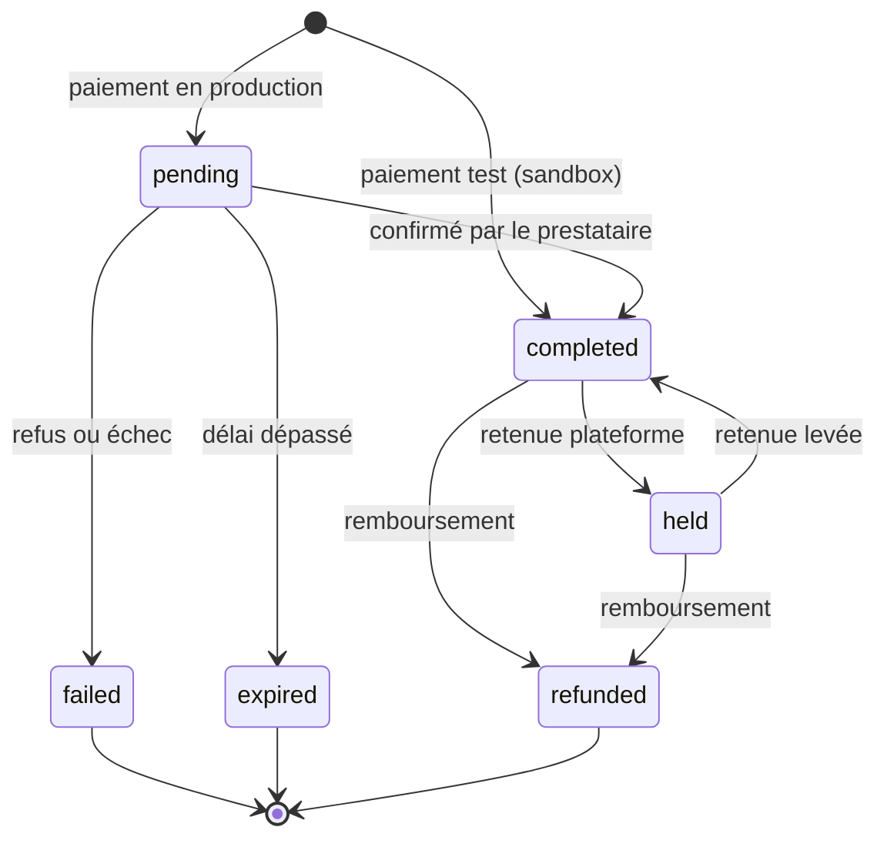

import { DocsAgentIndex } from '@/components/docs/docs-agent-index';

<DocsAgentIndex />

Cette page est la carte marchande des statuts de paiement et de reversement.

## Encaissement

En **test**, un paiement est souvent `completed` tout de suite. En **production**, il reste en général `pending` jusqu’à ce que le client valide (mobile money, carte, etc.).

### Statuts des paiements

| Statut | Ce que ça veut dire |
| --- | --- |
| `pending` | Paiement lancé, résultat pas encore connu (fréquent en production). Ne pas livrer. |
| `completed` | Paiement réussi. Crédit du solde test ou live ; livrer après [vérification](/build/reliability/verify-payments). |
| `held` | Paiement capturé mais bloqué par la plateforme. Non retirable, hors revenus tant que la retenue n’est pas levée ou remboursée. |
| `failed` | Le paiement n’a pas abouti. Libérer le stock ; proposer une nouvelle tentative. |
| `expired` | Le client n’a pas finalisé à temps. Libérer le stock ; proposer une nouvelle tentative. |
| `refunded` | Remboursement effectué sur ce paiement. Annuler la livraison si besoin. |

### Côté prestataire

Chaque statut transaction a un équivalent côté prestataire (`provider_payment_status`) :

| Statut transaction | Statut prestataire |
| --- | --- |
| `completed` | `succeeded` |
| `held` | `succeeded` |
| `pending` | `processing` |
| `failed` | `cancelled` |
| `expired` | `expired` |
| `refunded` | `refunded` |

Voir [Transactions](/build/money/transactions) pour les champs dans les réponses API.

### Expiration

Un paiement `pending` peut expirer automatiquement :

- après un certain **délai** ;
- ou quand la **session prestataire** expire (par exemple Wave `when_expires`).

L’info d’expiration est stockée dans `expiration_info` sur la transaction.

### Effets d’un paiement `completed`

La complétion est idempotente. Un webhook en double ne crédite pas le solde deux fois : lomi. fusionne les métadonnées et ne crédite qu’une fois.

- Le coupon utilisé peut être comptabilisé.
- Un abonnement lié peut passer de `pending` à `active`.

Pour le délai de disponibilité des fonds, voir [Solde et règlement](/build/money/balance-and-settlement).

## Décaissement (reversements et remboursements)

Les reversements passent par `pending` → `processing` → `completed` ou `failed`. Considérez **`completed`** comme « fonds sortis de la plateforme ».

### Retraits vs bénéficiaires

- **Retraits** : fonds de votre solde lomi. vers vos propres moyens (mobile money, banque, etc.).
- **Virements vers bénéficiaires** : fonds envoyés vers un compte tiers (prestataires, partenaires, routage des remboursements).

Certains flux **valident le solde à la création** et **débitent ou finalisent à la complétion**. Un virement peut être accepté tout en étant encore en cours. Si le solde évolue avant le règlement, **la complétion peut échouer**.

### Frais et plafonds

Les frais dépendent de la configuration tarifaire de l’organisation, du prestataire et du moyen (banque locale vs internationale), et de la devise. Les retraits peuvent imposer des montants min/max et des caps par période. Voir [Tarification](/start/merchant-of-record/pricing).

### Échecs

Les échecs peuvent venir de coordonnées invalides, d’un refus prestataire ou d’un solde insuffisant au règlement. Consultez le statut dans l’API. Voir [Virements](/build/money/payouts) et [Remboursements](/build/money/refunds).

## Soldes et règlement

Les paiements `completed` mettent à jour votre solde marchand selon les frais et délais de disponibilité. Voir [Solde et règlement](/build/money/balance-and-settlement).

## Les webhooks relient tout

1. [Configurer les webhooks](/build/reliability)
2. [Gestion des webhooks](/build/reliability/handling-webhooks)
3. [Fiabilité des webhooks](/build/reliability/webhook-reliability)

<DocsNextSteps>
  <DocsNextStep href="/build/accept/checkout-behavior" hint="En attente et essais">
    Comportement checkout
  </DocsNextStep>
  <DocsNextStep href="/build/reliability/simulate-errors" hint="Échecs en sandbox">
    Simuler les erreurs
  </DocsNextStep>
  <DocsNextStep href="/build/money/transactions" hint="Grand livre après paiement">
    Transactions
  </DocsNextStep>
</DocsNextSteps>
