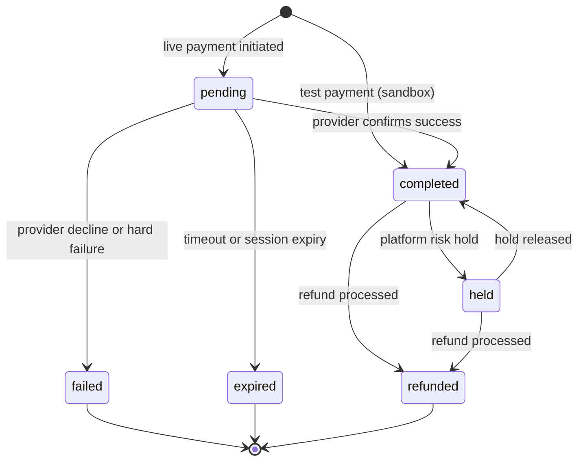

import { DocsAgentIndex } from '@/components/docs/docs-agent-index';

<DocsAgentIndex />

Use this page as the merchant-facing map for payment and payout status.

## Money in (payments)

In **test**, new payments often start as `completed` immediately. In **live**, they typically start `pending` until the customer approves mobile money or the card issuer confirms.

### Transaction statuses

| Status | Meaning |
| --- | --- |
| `pending` | Payment initiated; final outcome not yet confirmed (typical in **live**). Do not fulfill. |
| `completed` | Payment succeeded. Credit test or live balance; fulfill after [verification](/build/reliability/verify-payments). |
| `held` | Captured payment frozen by the platform. Not withdrawable and excluded from revenue until released or refunded. |
| `failed` | Payment did not succeed. Release inventory; offer retry. |
| `expired` | Pending payment timed out. Release inventory; offer retry. |
| `refunded` | Refund processed against the original payment. Reverse fulfillment if applicable. |

### Provider-facing status mapping

Platform `transaction_status` is reflected in `provider_payment_status` on linked provider records:

| Transaction status | Provider payment status |
| --- | --- |
| `completed` | `succeeded` |
| `held` | `succeeded` |
| `pending` | `processing` |
| `failed` | `cancelled` |
| `expired` | `expired` |
| `refunded` | `refunded` |

See [Transactions](/build/money/transactions) for field names in API responses.

### Pending expiration

Pending transactions can expire automatically:

- By **age** (older than the platform TTL).
- Optionally by **provider session expiry** (for example Wave `when_expires`).

Expired rows carry `expiration_info` in metadata describing why they closed.

### What happens on `completed`

Completion is idempotent. A duplicate completion does not credit the balance twice: metadata is merged, but the balance is credited once.

- Coupon usage may be incremented.
- Subscriptions linked to the transaction may move from `pending` to `active`.

For balance timing, see [Balance and settlement](/build/money/balance-and-settlement).

## Money out (payouts and refunds)

Payouts move through `pending` → `processing` → `completed` or `failed`. Treat **`completed`** as “funds left the platform” for withdrawals and beneficiary payouts.

### Withdrawals vs beneficiaries

- **Withdrawals**: funds from your lomi. balance to your own payout method (mobile money, bank, and similar).
- **Beneficiary payouts**: funds sent to a third-party account (vendors, partners, or refund routing).

Some flows **validate balance at creation** and **debit or finalize on completion**. A payout can be accepted while still processing. If the balance changes before final settlement, **completion can fail** and the payout may be marked failed or reversed according to provider rules.

### Fees and limits

Payout fees depend on organization fee configuration (including tiered overrides), provider and payment method (for example local vs international bank), and currency. Withdrawal flows can enforce minimum/maximum amounts and per-period caps. Exact numbers are configured per organization and provider. See [Pricing](/start/merchant-of-record/pricing).

### Failure and retries

Failures may occur due to invalid account details, provider rejection, or insufficient balance at settlement time. Check payout status and metadata in the API. See [Payouts](/build/money/payouts) and [Refunds](/build/money/refunds).

## Balances and settlement

Completed payments update your merchant balance according to fee rules and availability windows. See [Balance and settlement](/build/money/balance-and-settlement).

## Webhooks tie it together

Configure webhooks so your system reacts when status changes without polling:

1. [Setting up webhooks](/build/reliability)
2. [Handling webhooks](/build/reliability/handling-webhooks)
3. [Webhook reliability](/build/reliability/webhook-reliability)

<DocsNextSteps>
  <DocsNextStep href="/build/accept/checkout-behavior" hint="Pending and trials">
    Checkout behavior
  </DocsNextStep>
  <DocsNextStep href="/build/reliability/simulate-errors" hint="Failure paths in sandbox">
    Simulate errors
  </DocsNextStep>
  <DocsNextStep href="/build/money/transactions" hint="Ledger after pay">
    Transactions
  </DocsNextStep>
</DocsNextSteps>
